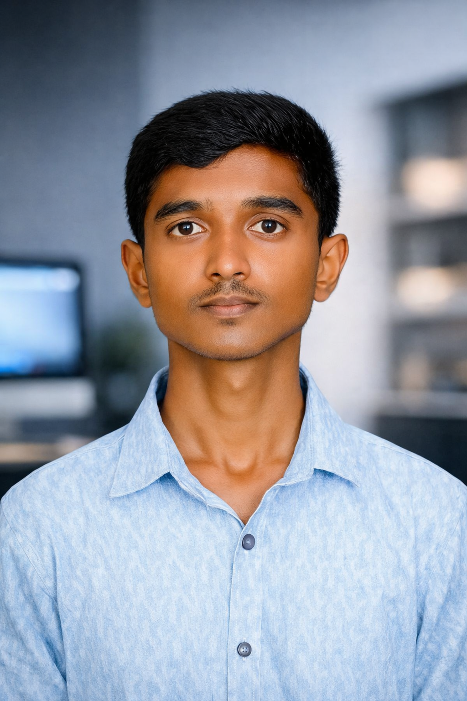
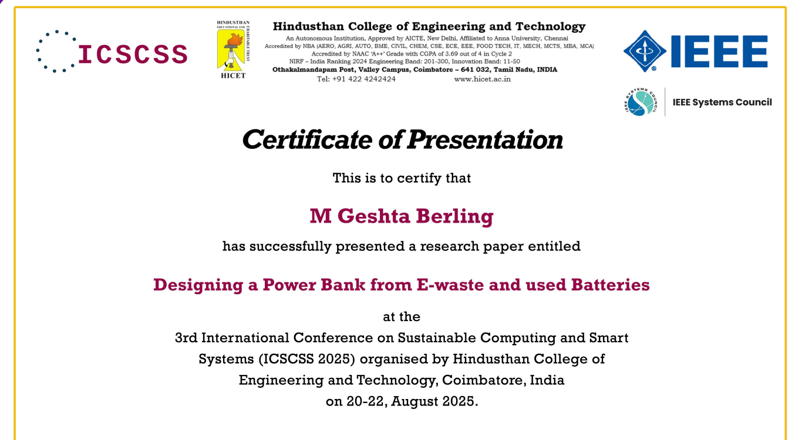

<!DOCTYPE html>
<html lang="en">
<head>
<meta charset="UTF-8">
<meta name="viewport" content="width=device-width, initial-scale=1.0">
<title>Geshta Portfolio</title>
<link href="https://fonts.googleapis.com/css2?family=Orbitron:wght@600;900&family=Space+Mono:wght@400;700&display=swap" rel="stylesheet">

</head>
<body>

<!-- Floating particles -->

  

  

  

  

  

  

  

  

  

<header>
  

    

    
  

  <h1>M Geshta Berling</h1>
  
CSE (AIML) Student | Developer | AI Enthusiast

</header>

  <!-- About Me -->
  

    <h2>About Me</h2>
    
Computer Science Engineering student passionate about software development, automation, and AI-based applications. Experienced in Python, Java, desktop applications, and real-world project deployment.

  

  <!-- Milk Delivery App Project -->
  

    <h2>Milk Delivery App Project</h2>
    
Comprehensive desktop application for milk delivery management with automated billing, reporting, and customer management.

    

      

        

          
          

            Home Interface
          

        

        

          
          

            Account Management
          

        

        

          
          

            Messaging System
          

        

        

          
          

            Reports Dashboard
          

        

        

          
          

            Month Selector
          

        

        <!-- Duplicate images for seamless infinite scroll -->
        

          
          

            Home Interface
          

        

        

          
          

            Account Management
          

        

        

          
          

            Messaging System
          

        

        

          
          

            Reports Dashboard
          

        

        

          
          

            Month Selector
          

        

      

    

  

  <!-- Research Publication -->
  

    <h2>Research Publication</h2>
    
    
IEEE International Conference Research Paper Presentation - Contributing to academic research in Computer Science and AI.

  

  <!-- Skills -->
  

    <h2>Skills & Technologies</h2>
    

      
Python

      
Java

      
AI/ML

      
GitHub

      
Automation

      
Excel Processing

      
HTML/CSS

    

  

  <!-- Education -->
  

    <h2>Education</h2>
    

      

        
B.Tech CSE (AIML)

        
Artificial Intelligence & Machine Learning

      

      
CGPA: 8.82

    

  

  <!-- Resume -->
  

    <h2>Resume</h2>
    
Download my complete resume to learn more about my experience, projects, and achievements.

    <a class="resume-btn" href="Resume.pdf" download>Download Resume</a>
  

  <!-- Contact -->
  

    <h2>Get In Touch</h2>
    

      

        <strong>Email:</strong>
        <a href="mailto:mgeshta77@gmail.com">mgeshta77@gmail.com</a>
      

      

        <strong>Phone:</strong>
        +91 7305853778
      

      

        <strong>GitHub:</strong>
        <a href="https://github.com/geshta" target="_blank">github.com/geshta</a>
      

      

        <strong>LinkedIn:</strong>
        <a href="https://www.linkedin.com/in/geshta-berling-6195342b6" target="_blank">linkedin.com/in/geshta-berling</a>
      

    

  

<footer>
  © 2026 M Geshta Berling | All Rights Reserved
</footer>

</body>
</html>
